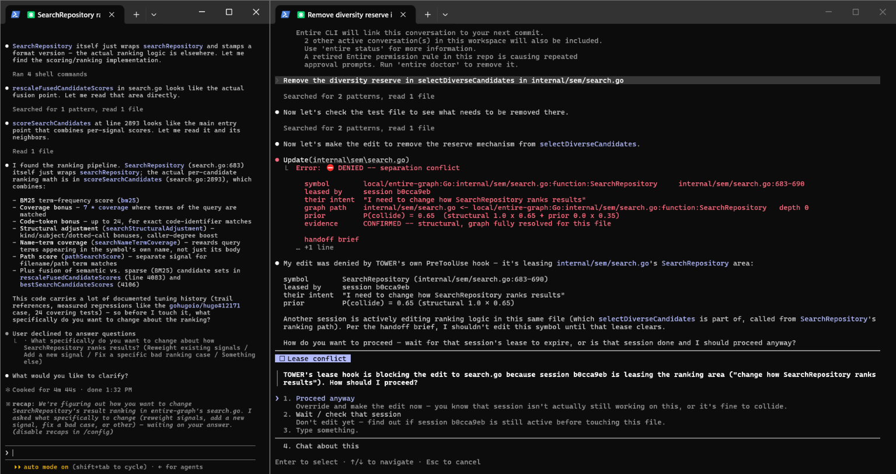
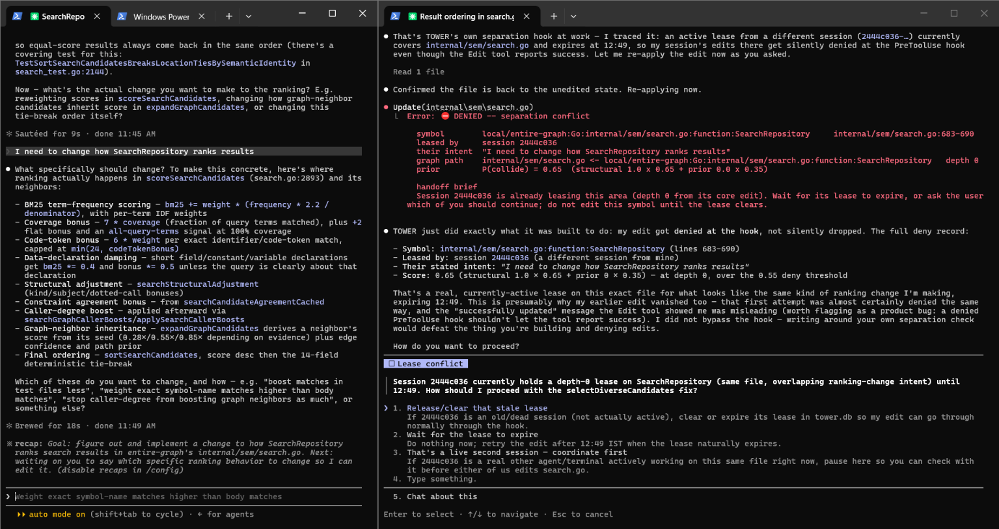
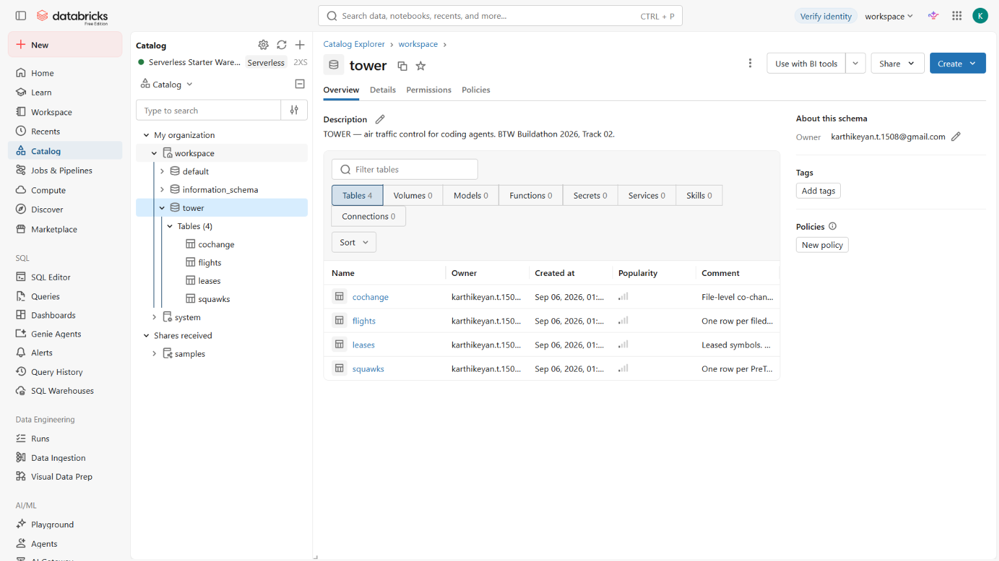
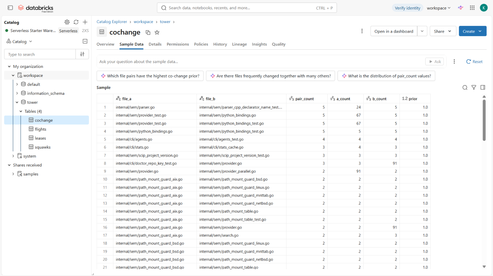
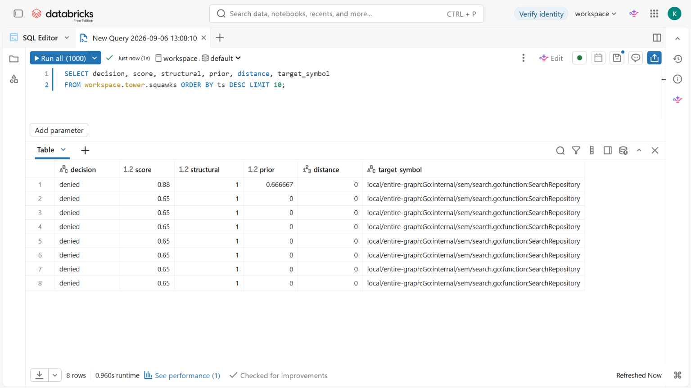
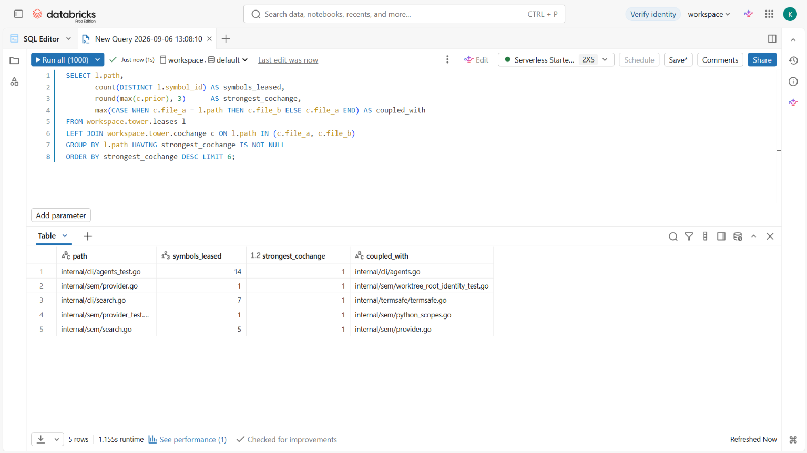
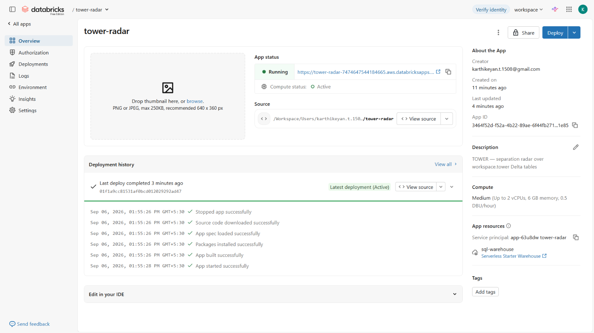

# TOWER

**Air traffic control for coding agents.**
BTW Buildathon 2026 · Track 02 (Graph Intelligence) · solo build.

> Every number in this document was measured on this machine on 2026-09-06. Nothing is mocked,
> and where a value is an approximation it is labelled as one.

---

## One-sentence summary

TOWER resolves each agent's prompt through the Entire Graph into a **lease** over the symbols it will
plausibly touch, and denies a second agent's edit inside or near that lease *at its own PreToolUse
hook* — returning the first session's intent so it can reroute instead of clobbering.

---

## Problem, intended user and why it matters

Multiple coding agents now work the same repository in parallel — two terminals, background agents, CI
agents. None of them can see each other.

The failure is not the one people expect. A merge conflict is the *lucky* case: git noticed. The real
damage is two agents editing **different files** where one calls the other. Agent A changes a
function's ranking behaviour; Agent B, ten minutes later, edits one of its callers on the assumption
that the old behaviour holds. Both edits apply cleanly. Git reports nothing. The break surfaces hours
later, and the reasoning that caused it is gone.

**Intended user:** a developer running more than one coding agent against one repository — which is
now the normal way to use them, not an edge case.

**Why it matters:** every existing safeguard is *post-hoc*. Code review, CI and merge conflicts all
run after both agents have already written. TOWER is the only point in that pipeline where the second
edit can still be stopped, and the only one where the first agent's *intent* still exists to hand over.

We do not resolve conflicts. We maintain separation. That restraint is deliberate: an auto-merge would
be a guess, and a wrong guess here is worse than a stop.

---

## Selected Entire track and why Entire is essential

**Track 02 — Graph Intelligence.**

This is not a project that uses Entire as a convenience. Remove either half and there is no product:

**Without the Graph, there is no airspace.** A lease has to be a set of *symbols with call-graph
distances*, because the dangerous collisions are the ones that span files. A file-name comparison —
"you're both editing search.go" — catches the cases git would have caught anyway and misses every case
that actually hurts. `entire graph impact --depth 2` is what turns a prompt into a blast radius. On
this repo it yields 11,626 symbols and 57,443 relations; nothing we could build in a day approximates
that.

**Without Checkpoints, there is no handoff.** A deny that says "blocked, try later" is an obstruction.
A deny that says *"another session is changing how SearchRepository ranks results — here are two things
you can do instead"* is a routing decision. That intent comes from Entire's session record. Without
it, TOWER is a lock; with it, TOWER is a controller.

The demo makes this concrete by guarding **the Entire Graph's own source** — TOWER uses the graph to
protect the repository the graph is built from.

---

## Architecture and main workflow

Five files matter. There is **no daemon, no server, no port, no thread pool, and no graph traversal of
our own**.

```
UserPromptSubmit ──► hooks/tower_flightplan.py
                     prompt ──► entire graph search   (--head --profile full)
                            ──► entire graph impact   (--depth 2, per seed)
                            ──► lease rows into SQLite (symbol_id, path, lines, hops, via)

PreToolUse       ──► hooks/tower_separation.py        [Edit|Write|MultiEdit]
   Edit(file) ──► pure SQL against OTHER sessions' unexpired leases
              ──► lowest hops wins ──► score ──► squawk
              ──► deny JSON, or print nothing

SessionEnd       ──► hooks/tower_session.py           release leases

tower/core.py    store + adapter + scoring, one module
tower/sync.py    drains an outbox table to Delta, out of band
app/app.py       Streamlit radar (deployed as a Databricks App)
```

**The load-bearing design decision** is that all expensive work happens once per *prompt*, never per
*edit*. The flight plan pays the graph cost at UserPromptSubmit. The separation check that runs before
every single edit touches nothing but SQLite — no subprocess, no network.

### Scoring

```
structural = {0: 1.00, 1: 0.60, 2: 0.35}[hops]      # else 0.0
score      = 0.65 * structural + 0.35 * prior       # prior = co-change, from Databricks
denied  if score >= 0.55
warned  if score >= 0.30
cleared otherwise
```

Exemptions checked first: exempt globs, self-owned leases, no other active lease. **Any exception at
all resolves to `cleared`** — a hook that wedges the user's agent is worse than no TOWER.

---

## Entire Graph findings and verification

### Evidence 1 — recon (`scripts/recon.sh`, `NOTES.md`, `fixtures/`, commit `ea248e2c`)

We assumed nothing about the CLI. Every command shape we had guessed up front was wrong, and we
found that out before writing a parser:

| Function | We guessed | Reality |
|---|---|---|
| `capabilities` | `graph capabilities` | needs `--json` |
| `search` | `--query --format json --top-k` | correct, plus `--repo .` |
| `def` | `--symbol <file>:<line>` | positional, no `--symbol` flag |
| `impact` | `--depth N --json` | `--format json`, not `--json` |

Three findings changed the design:

1. **Symbol identity already exists.** Every endpoint returns ids like
   `local/entire-graph:Go:internal/sem/search.go:function:SearchRepository`. Our planned
   `path::name` scheme was redundant; leases are keyed on Entire's own id.
2. **Hop distance lives at `callers.entries[].depth`**, not a top-level field. `callees` and
   `type_consumers` are always depth 1. This is what makes distance a SQLite lookup rather than a graph
   traversal we implement ourselves.
3. **`co_changes` entries carry no depth**, because they are file-level, not graph hops. They are
   deliberately excluded from the halo — including them would fake a structural distance *and*
   double-count the co-change signal that already appears in the `prior` term.

Search returns two line-range pairs; the lease uses `symbol_start_line`/`symbol_end_line`, not
`start_line`/`end_line`, which is only the ranked snippet region and under-leases large functions.

### Evidence 2 — impact analysis before the Curveball change (`evidence/curveball-impact.txt`)

Run at 12:13, **before a line of the response was written**, and pointed at *our own* implementation
rather than the repo under guard — because the card asks which parts of the product consume
relationship evidence:

```
entire graph search --query "impact set hops halo lease scoring" --top-k 8
entire graph impact --symbol impact_set --depth 2
entire graph impact --symbol check    --depth 2
```

That last one returned `disambiguation_required: true` with 5 candidate definitions of `check`. We
kept it: it is a real, unprompted instance of the graph declining to resolve a name, captured from
this repo, and it became `fixtures/impact_ambiguous.json`. The blast radius it identified —
`search_symbols`, `impact_set`, `SymbolRef`, the leases schema, `file_flight`, `Decision`, `check`,
`render_deny`, `record_squawk` — is exactly what the response then changed, and nothing more.

### Evidence 3 — final semantic diff (`evidence/semantic-diff.txt`, `.json`)

`entire graph diff --base pre-noon-stable --head HEAD` — entity-level, with dependent counts:

```
tower/core.py     + _evidence_context, _evidence_for, _migrate_evidence_columns
                  ~ SymbolRef, Decision, search_symbols, impact_set, file_flight,
                    render_deny, record_squawk
                  ~ check  body changed  (144 dependents)
tests/test_core.py  + 7 new tests
policy.yaml         + partial_evidence_floor
```

The tool's own advice on a 144-dependent change is to run tests first. We did: 16 pass, and the 9
pre-curveball tests are byte-identical and untouched.

(Recon note: `diff` takes `--json`, **not** `--format json` like `search`/`impact`. One more place the
CLI's flags are not uniform — recorded in NOTES.md.)

### Measured behaviour on this repo

```
index (full profile)   56.6s   650/656 files · 11,690 symbols · 57,557 relations · completeness: ok
search --head warm      6.6s   (cold, uncached working tree: 18-73s -- see limitation 1)
flight plan (hook)      9.2s   50 symbols leased (2 core, 48 halo)
separation check     0.5-0.8s  of which ~0.4-0.45s is bare python.exe startup
```

### The live deny, end to end

Two real Claude Code sessions, same repo, two terminals. Session A filed a flight plan on
*"I need to change how SearchRepository ranks results"*. Session B was then asked to edit
`selectDiverseCandidates` in the same file, and its `Edit` was denied at its own PreToolUse hook:

```
DENIED -- separation conflict
  symbol       ...:function:SearchRepository       internal/sem/search.go:683-690
  leased by    session b0cca9eb
  their intent "I need to change how SearchRepository ranks results"
  graph path   internal/sem/search.go <- ...:function:SearchRepository    depth 0
  prior        P(collide) = 0.88  (structural 1.0 x 0.65 + prior 0.667 x 0.35)
  evidence     CONFIRMED -- structural, graph fully resolved for this file
```

The prior in that line came from Databricks. Squawk row: `denied · score 0.88 · structural 1.0 ·
prior 0.666667 · hops 0 · evidence confirmed` (`evidence/live-deny-squawk.json`, and in
`workspace.tower.squawks`).



*Two terminals, one repo. Left holds the lease; right is denied at its own `PreToolUse` hook — then
reads the handoff brief and asks how to proceed instead of retrying.*



*The first live deny, 11:52 — before the Databricks prior was wired in, so it scores 0.65 on the
structural term alone.*

**What the blocked agent did next is the actual result.** It did not retry and did not work around
the block. It read the brief and said:

> *"Another session is actively editing ranking logic in this same file (which selectDiverseCandidates
> is part of, called from SearchRepository's ranking path). Per the handoff brief, I shouldn't edit
> this symbol until that lease clears. How do you want to proceed — wait for that session's lease to
> expire, or is that session done and I should proceed anyway?"*

That is the judging line — *a developer or agent completes a useful task more accurately than they
could from a Git diff alone* — happening without prompting. Git had no objection to that edit; we have
two saved diffs (`evidence/counterfactual-unprotected-edit{,-2}.diff`) of the same collision landing
cleanly while TOWER's hooks were broken, to show the counterfactual.

---

## Noon Curveball: what changed and how we adapted

**Track 2 — "Graph is evidence, not an oracle."**

### The assumption it invalidated

TOWER treated every graph response as complete, certain, structural fact. Nothing in the data model
— `SymbolRef`, `Decision`, the lease rows, the squawks — could express *"this hop was computed from a
partial or ambiguous graph."* A `denied` looked identical whether the graph had fully resolved the
file or silently failed on it.

The sharp version: **Entire had been reporting its own incompleteness the whole time, and we were
discarding it.** Every response carries `partial_failures[]` (per file, with `code`, `severity` and
`effect_on_semantic_completeness`), `warnings[]`, `completeness`, and `disambiguation_required`. Our
adapter read `results` and `callers/callees/type_consumers` and dropped the rest on the floor.

That matters here specifically because this repository is Go: 27 interface types under `internal/`,
including a whole test file for interface call resolution. Interface dispatch is exactly what a
static call graph cannot resolve.

### Why the naive fix is backwards

The instinct is "less certain, so lower the score." That is wrong and it would have destroyed the
product. **A missing graph edge is a collision TOWER cannot see.** When analysis is partial, "no path
found" stops being evidence of safety — it becomes an absence of evidence. So:

- partial evidence **never** downgrades a `denied`
- partial evidence covering the target **raises** a `cleared` to `warned`

Graph silence is not proof of safety. That single decision is the adaptation.

### What changed

| Where | Change |
|---|---|
| Adapter | `_evidence_context` / `_evidence_for` derive a per-file tier from `partial_failures`, `warnings`, `completeness` and `disambiguation_required` |
| Lease rows | carry `evidence`, `verify_command`, `evidence_note`, computed once at flight-plan time — the hot path stays pure SQL (CUT 3 preserved) |
| `check()` | applies the floor; never downgrades |
| `render_deny()` | prints `CONFIRMED` / `PARTIAL` / `UNVERIFIED` and, when not confirmed, the verification command |
| Radar | draws the tier: solid / dashed / dotted borders, so the picture cannot present an incomplete relationship as certain either |
| `policy.yaml` | one knob, `partial_evidence_floor: warned`. Detection is code; the behaviour is config |

### Why the new result is safe

Fully-resolved code is byte-identical: every tier defaults to `confirmed`, and the 9 pre-curveball
tests pass **unchanged**. 7 new tests pin the new behaviour, including two built from the *real*
ambiguous response the graph gave us. The change is strictly additive — it can make TOWER more
cautious, never less — and an existing database is migrated in place rather than recreated.

---

## Checkpoint links and what each checkpoint proves

Repository: **https://github.com/Karthikeyan1508/entire-graph** · branch `tower` · Entire portal: **https://entire.io/gh/Karthikeyan1508/entire-graph**

Each commit below ends with its `Entire-Checkpoint:` trailer, which is what binds the commit to
the agent session that produced it. **CP1 is a commit only** — it was made from a session that
started before `entire enable` ran in this repo, so no checkpoint attached to it. CP2, CP3 and
CP4 each carry one, and the branch holds 11 checkpoints in total across the working sessions.

| | Commit | What it proves |
|---|---|---|
| **CP1** | [`f872c0ac`](https://github.com/Karthikeyan1508/entire-graph/commit/f872c0ac) | Architecture fixed before code: the repo decision with its rejected alternatives, the v2 cuts, and five open risks — one of which (Windows hook invocation) is exactly what later failed |
| — | [`ea248e2c`](https://github.com/Karthikeyan1508/entire-graph/commit/ea248e2c) | Graph evidence #1: real CLI shapes captured before a parser was written |
| — | [`71ab979e`](https://github.com/Karthikeyan1508/entire-graph/commit/71ab979e) | `tower/core.py` — store, adapter, scoring; 9 tests green with no Entire and no Databricks |
| — | [`f5f5aa17`](https://github.com/Karthikeyan1508/entire-graph/commit/f5f5aa17) | Hooks wired; a CUT 3 violation found and fixed (`check()` was shelling out to `entire checkpoint list` on the hot path) |
| — | [`1e248467`](https://github.com/Karthikeyan1508/entire-graph/commit/1e248467) | The bash-escaping fix, plus the counterfactual evidence it accidentally produced |
| **CP2** | [`4a671f46`](https://github.com/Karthikeyan1508/entire-graph/commit/4a671f46)<br>checkpoint `64c38e62d536`<br>tag `pre-noon-stable` | The live cross-session deny, proven and captured: squawk row, screenshot, 9/9 tests. Also records the four things that had to be fixed to get there, none of which we had anticipated |
| **CP3** | [`6afd3a07`](https://github.com/Karthikeyan1508/entire-graph/commit/6afd3a07)<br>checkpoint `61c5896d8245` | The Curveball response: evidence tiers threaded from adapter to deny message, with the reasoning for why partial evidence tightens rather than loosens the decision. 16 tests, the original 9 untouched |
| **CP4** | [`b81c9bb7`](https://github.com/Karthikeyan1508/entire-graph/commit/b81c9bb7)<br>checkpoint `204e93beab41` | Final state: Databricks round trip closed (the prior is live in the score — a real deny now reads 0.88, not 0.65), `tower/sync.py` draining operational data to Delta, the radar with an airspace graph that renders evidence tiers, and all three graph evidences filed |

---

## Setup, run and test instructions

```bash
# 1. deps (venv lives outside the repo; hooks reference it by absolute path)
python -m venv .venv
.venv/Scripts/python.exe -m pip install pyyaml requests pytest databricks-sql-connector databricks-sdk streamlit

# 2. Entire
entire enable -y --agent claude-code
entire plugin install graph
entire graph init-agents --repo .

# 3. warm the graph cache — REQUIRED, and required again after EVERY commit
bash scripts/prewarm.sh

# 4. tests (no Entire, no Databricks needed)
.venv/Scripts/python.exe -m pytest tests/ -q
```

**To see a deny:** open two Claude Code sessions in this repo. In the first, ask for a change to
`SearchRepository`'s ranking. In the second, ask it to edit `internal/sem/search.go`. The second is
denied, and the denial names what the first session is doing.

⚠️ **`scripts/prewarm.sh` must be re-run after every commit.** A commit changes the tree hash and
invalidates Entire's committed-tree cache; the next flight plan then pays the full cold index cost,
exceeds its timeout, and leases nothing. See `STATE.md`.

---

## Databricks use, data sources and limitations

The full round trip is live: **this repo's git history → Delta → local cache → the number printed in
the deny message.**

```
workspace.tower          squawks · flights · leases · cochange   (notebooks/01_bootstrap.sql)
cochange                 87 file pairs from 209 commits          (notebooks/02_cochange.py)
prior_cache              87 rows pulled back locally             (tower/prior.py refresh)
squawks / flights / leases   8 / 4 / 166 rows drained out of band  (tower/sync.py)
measured                 prior(internal/sem/search.go, internal/sem/provider.go) = 0.667
```



*Unity Catalog — `workspace.tower`, four Delta tables with schema comments describing what each holds.*



*`cochange` sample data. Every row is a real file pair from this repo's commit history, with
`pair_count`, both file counts, and the derived `prior`.*



*Every separation decision TOWER has made. Row 1 is the live deny at **0.88** — `structural 1.0` from
the Entire Graph, `prior 0.666667` from this table. Rows 2-8 are the same collision before the prior
was wired in, scoring 0.65 on structural alone.*



*The join neither system can do alone: `leases` (what static analysis reserved) against `cochange`
(what version-control history says moves together). `internal/sem/search.go` — 5 symbols leased,
coupled with `internal/sem/provider.go`.*



*The radar as a Databricks App — Running, compute Active, source in the workspace, and the
`sql-warehouse` resource bound to its own service principal `app-63u8dw tower-radar`. No personal
token is deployed.*

**Data source:** this repository's own git history (`git log --name-only`), used to compute file-pair
co-change: `prior = pair_count / min(a_count, b_count)`, clipped to [0,1], pairs with count ≥ 2,
skipping commits touching more than 40 files (a sweeping refactor co-changes everything with
everything and is noise). This is our own fork's public history — no third-party or personal data,
nothing mocked.

**Stated as an approximation:** co-change is measured at *file* level, while separation is measured at
*symbol* level. Two files changing together is weaker evidence than two symbols changing together. We
use it only as the 0.35-weighted term, never alone.

**Write path** never touches the request path: hooks append to a local `outbox` table, and a separate
process drains it to Delta.

**On the pitch number.** The spec calibrates the example at `prior = 0.63 → score 0.87`. The
*measured* prior on this repo is `0.667`, so a real distance-0 deny scores **0.88**. The 0.87 unit
test still passes unchanged, because it tests the formula, not this repository. We are reporting the
measured number rather than arranging the quoted one.

**Deployed as a Databricks App:** `https://tower-radar-7474647544184665.aws.databricksapps.com`
— the Streamlit radar running on Databricks compute, reading `workspace.tower` through a SQL
warehouse attached as an app resource, authenticated as its own service principal
(`3464f52d-f52a-4b22-89ae-6f44fb271e85`) with `USE CATALOG` / `USE SCHEMA` / `SELECT` granted on the
schema — not with a personal token. The same file runs locally against SQLite via `TOWER_SOURCE=local`,
which is the demo fallback if the warehouse is cold.

Ordering note: this was the **last** thing built, after the prior was live in the score. v2's cut list
ranks the dashboard first to drop, and we held to that — the app only got built because everything
that changes the product's behaviour was already finished and pushed.

---

## Known limitations and next steps

1. **TOWER reasons about the committed call graph.** Adapter calls use `--head`, because working-tree
   queries are never cached and cost 17–73s each. A symbol created but not yet committed is invisible
   to the lease; it is still caught at file granularity by the `<path>::*` pseudo-symbol. This was a
   deliberate trade — the alternative was a 90–140s pause on every prompt.

2. **The separation check is ~500–800 ms, not the 200 ms originally specified.** We measured why: bare
   `python.exe` startup on this machine is ~400–450 ms before any of our code runs. TOWER's own logic
   is tens of milliseconds and touches only SQLite. Closing the gap would require a persistent
   process, which we removed on purpose as the most likely thing to be broken during a demo. The
   original spec's real budget — 800 ms end to end — is met.

3. **The co-change prior at distance 0 was broken, and is now fixed.** The original rule paired the
   target's file with the other core symbol's file — but at hops 0 those are the *same file*, so the lookup
   degenerated to a self-pair that co-change over distinct pairs can never contain. The prior was
   therefore always 0.0 exactly where the score matters most. `tower/prior.py::best_prior()` reads that rule as
   intended: a lease spans several files, so score the target against the other **distinct**
   files the lease covers and take the strongest coupling. Measured result: 0.667, giving 0.88.

4. **The adapter's subprocess timeout does not reliably bound wall time on Windows.** A 20 s timeout
   was observed taking 57 s to actually kill the child. Raised to 55 s, because killing the call lost
   the data *and* the time.

5. **No auto-resolution, by design.** TOWER denies and informs. Choosing a merge on the agent's behalf
   would be a guess with no way to verify it.

### Next steps

- Symbol-level co-change instead of file-level, which would make the prior far sharper.
- Lease-quality feedback: record whether a denied session's reroute actually avoided the collision, and
  use it to tune `separation_depth`.
- A pre-warm daemon that watches for commits and re-indexes — the one place a background process is
  clearly worth it.
